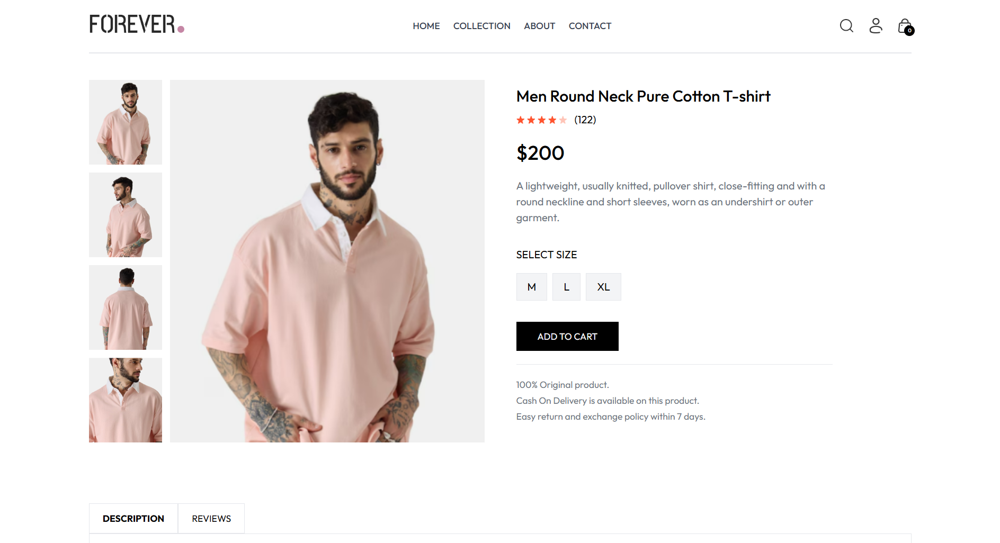
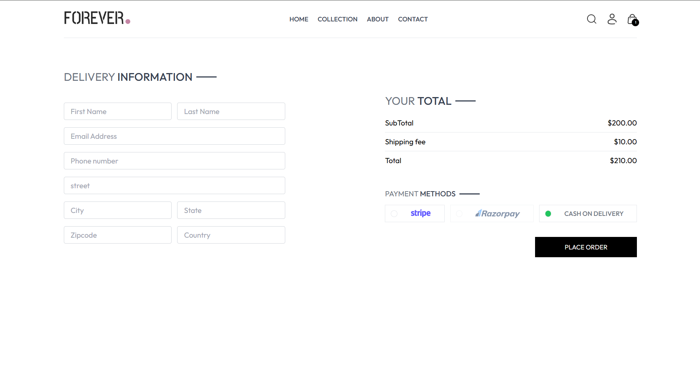
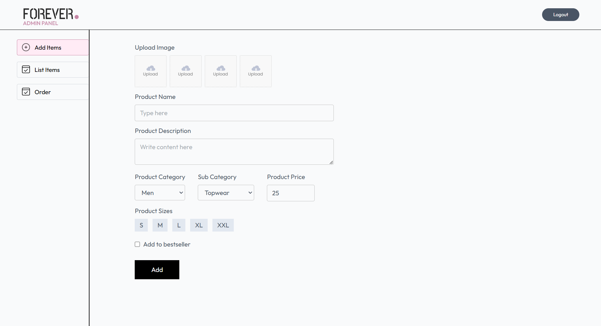

# 🛍️ Forever – A Modern E-Commerce Platform

Welcome to **Forever**, a fully functional and responsive e-commerce platform built with the **MERN stack**.

🚀 [Live Demo](https://forever-umber.vercel.app) | 📂 [GitHub Repository](https://github.com/jaineet06/Forever)

## 📚 Tech Stack

- **Frontend**: React, TailwindCSS
- **Backend**: Node.js, Express
- **Database**: MongoDB
- **Deployment**: Vercel

---


## 🌟 Key Features

✅ **User Experience**:
- Modern UI with seamless navigation
- Intuitive product browsing & search
- Secure user authentication (login/logout)

✅ **Admin Panel**:
- Add, update, and delete products
- Order management and tracking
- Real-time analytics dashboard

✅ **Checkout Process**:
- Dynamic cart management
- Secure payments (Stripe)
- Order summary and confirmation

---

## 📸 Screenshots

### 🏠 Home Page


### 📦 Product Page


### 🛒 Checkout Page


### 🔐 Admin Panel - Dashboard


---


## Installation

Follow the steps below to set up the project locally:

### 1. Clone the repository
```bash
git clone https://github.com/jaineet06/Forever.git
cd Forever
```
### 2. Install server dependencies
```bash
cd server
npm install
```
### 3. Install client dependencies
```bash
cd ../client
npm install
```
### 4. Install admin panel dependencies
```bash
cd ../admin
npm install
```
### 5.  Create environment files
#### server/.env
```bash
MONGODB_URI = your_mongodb_connection_string
# ➤ Create a free cluster at https://cloud.mongodb.com and get your connection URI

CLOUDINARY_API_KEY = your_cloudinary_api_key
CLOUDINARY_SECRET_KEY = your_cloudinary_secret
CLOUDINARY_NAME = your_cloudinary_cloud_name
# ➤ Sign up at https://cloudinary.com and create a new project to get these values

ADMIN_EMAIL = your_admin_email
ADMIN_PASSWORD = your_admin_password
# ➤ Set your own admin credentials for login access

JWT_SECRET_KEY = your_jwt_secret
# ➤ Generate a secure string using any random password generator or tool like https://randomkeygen.com

STRIPE_SECRET_KEY = your_stripe_secret_key
# ➤ Create a Stripe account at https://dashboard.stripe.com/register and get the test secret key from the Developers section
```
#### client/.env
```bash
VITE_BACKEND_URL = http://localhost:4000
VITE_ADMIN_URL = http://localhost:5174
````

#### admin/.env
```bash
VITE_BACKEND_URL = http://localhost:4000
````

### 6.  Run the application
####  Start the frontend
```bash
cd client
npm run dev
```
####  Start the admin
```bash
cd admin
npm run dev
```
####  Start the backend
```bash
cd client
npm run server
```


## 📧 Connect With Me

Let's discuss the project! Reach out on:
- LinkedIn: [Jaineet Shah](https://www.linkedin.com/in/jaineet-shah-5894a731b)
- GitHub: [jaineet06](https://github.com/jaineet06)
