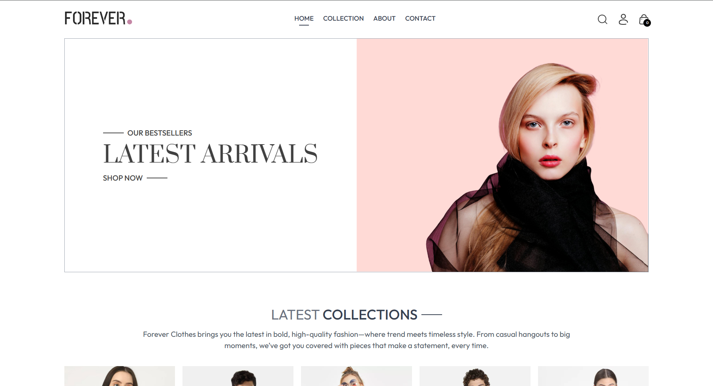

# 🛍️ Forever – A Modern E-Commerce Platform

Welcome to **Forever**, a fully functional and responsive e-commerce platform built with the **MERN stack**.

🚀 [Live Demo](https://forever-umber.vercel.app) | 📂 [GitHub Repository](https://github.com/jaineet06/Forever)

## 📚 Tech Stack

- **Frontend**: React, TailwindCSS
- **Backend**: Node.js, Express
- **Database**: MongoDB
- **Deployment**: Vercel

---

## 🌟 Key Features

✅ **User Experience**:
- Modern UI with seamless navigation
- Intuitive product browsing & search
- Secure user authentication (login/logout)

✅ **Admin Panel**:
- Add, update, and delete products
- Order management and tracking
- Real-time analytics dashboard

✅ **Checkout Process**:
- Dynamic cart management
- Secure payments (Stripe)
- Order summary and confirmation

---

## 📸 Screenshots

### 🏠 Home Page

### 📦 Product Page

### 🛒 Checkout Page

### 🔐 Admin Panel - Dashboard

---

## 📧 Connect With Me

Let's discuss the project! Reach out on:
- LinkedIn: [Jaineet Shah](https://www.linkedin.com/in/jaineet-shah-5894a731b)
- GitHub: [jaineet06](https://github.com/jaineet06)
